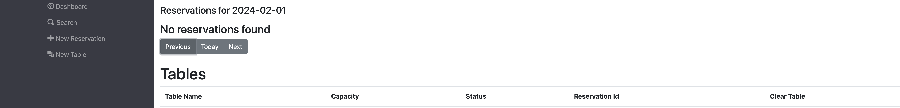
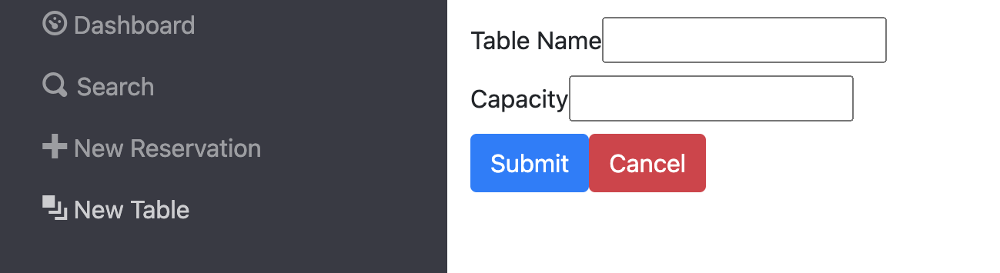
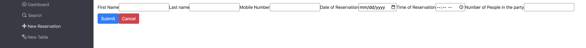

# Restaurant Reservation System

## Summary

For my final capstone project in the Chegg Skills Engineering program, I developed a restaurant reservation system.

This project utilized the following technologies:

- React for the client-side development
- Node.js and Express for building the API
- PostgreSQL for the database management

### From the Assignment

> You have been hired as a full stack developer at _Periodic Tables_, a startup that is creating a reservation system for fine dining restaurants.
> The software is used only by restaurant personnel when a customer calls to request a reservation.
> At this point, the customers will not access the system online.

You can find the original assignment starter code: [Here](https://github.com/Thinkful-Ed/starter-restaurant-reservation)
You can find the deployed [Backend](https://restaurantreservationsystem-backend.onrender.com/)
You can find the deployed [Frontend](https://restaurantreservationsystem-frontend.onrender.com/dashboard).
## Application Description

### Dashboard 

The Dashboard page showcases all reservations and tables for a specific date. Each reservation offers options to seat, edit, or cancel it. Tables are presented with their capacity and current status. If a table is occupied, it additionally displays the reservation ID and provides a button to clear the table once the dining is complete.

### New Table Page
The New Table page allows you to add a new table to the restaurant by providing a table name and table capacity.

### Edit Reservation
The Edit Reservation page allows you to edit the reservation you selected.

## API

| Request | Path                                | Description                                                |
|---------|-------------------------------------|------------------------------------------------------------|
| POST    | /reservations                       | Create a new reservation                                   |
| GET     | /reservations/:reservation_id       | Read a reservation by a reservation_id                     |
| PUT     | /reservations/:reservation_id       | Update a reservation by a reservation_id                   |
| PUT     | /reservations/:reservation_id/status| Update a reservation status by a reservation_id             |
| GET     | /reservations?mobile_number=XXXXXXXXXX | List all reservations that contain the partial or complete phone number entered, ordered by date |
| GET     | /reservations?date=XXXX-XX-XX       | List all reservations for a given date ordered by date     |
| GET     | /tables                             | List all tables                                             |
| POST    | /tables                             | Create a new table                                         |
| PUT     | /tables/:table_id/seat              | Update the table with a reservation                        |
| DELETE  | /tables/:table_id/seat              | Delete a reservation from a table                          |

## Installation
1. Fork and clone this repository.
2. Run cp ./back-end/.env.sample ./back-end/.env.
3. Update the ./back-end/.env file with the connection URL's to your ElephantSQL database instance.
4. Run cp ./front-end/.env.sample ./front-end/.env.
5. You should not need to make changes to the ./front-end/.env file unless you want to connect to a backend at a location other than http://localhost:5005.
6. Run npm install to install project dependencies.
7. Run npm run start:dev to start your server in development mode.
